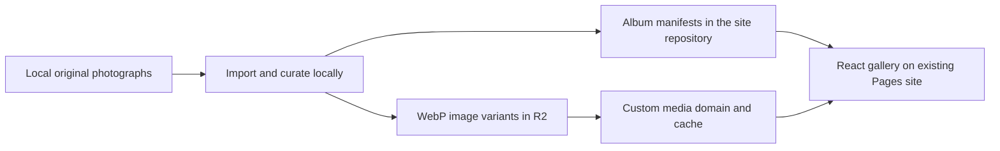

# NRG photo gallery approach

The gallery should feel like opening another part of the scrapbook: event albums,
large photo prints, and short factual captions. Use the existing photo collection
as the source. On 8 October 2026, `D:/Bilder/NRG` contains 2,782 image files,
totaling 17.15 GiB. File count is not yet a deduplicated gallery inventory.

## What visitors see

- Add **Gallery** to the navigation and a `/gallery` page.
- Start with album covers: Champions Paris 2025, Americas Stage 2 2025,
  and the 2026 events represented in the collection. Group by actual event
  metadata from the saved Flickr inventories, rather than guessing from filenames.
- Open an album into a contact sheet: mixed portrait and landscape photos,
  occasional larger featured prints, light rotation and tape. Keep photos clear
  and avoid overlap that obscures faces. No slogans or arrows without a purpose.
- Click a photo to view it at a larger size with previous/next controls,
  Escape to close, swipe on phones, and a small photographer/source credit.
  The lightbox contains the full uncropped image.
- Load the first 24 photos, then use **More photos**. Album/year filters come first;
  player filters can follow once the pictured players have been manually tagged.

## Hosting recommendation

Public hosting depends on photo rights, not download availability. The sampled
photos from all three source accounts say All rights reserved; the collection
is not yet cleared for a self-hosted bulk gallery. See the
[copyright research](gallery-copyright.md). Curate licensed or expressly permitted
photos before publishing derivatives; use source album links for uncleared photos.

Keep the existing React site on Cloudflare Pages. Store optimized gallery images
in **Cloudflare R2**, served through a custom media subdomain on the site's domain.
The subdomain is an example architecture choice; its exact name remains to be chosen.
R2 custom domains support Cloudflare's cache; `r2.dev` is intended for development.
See [R2 public buckets](https://developers.cloudflare.com/r2/buckets/public-buckets/).

The browser loads a small album index from the site, then fetches only the selected
album's metadata and visible images. No runtime Flickr scraper, database, or
public upload form is needed for this first version.

## Import and image handling

1. Read original files from `D:/Bilder/NRG`; preserve those originals locally.
2. Use the Flickr photo ID to match the existing saved title, event, source URL,
   creator and dimensions. Deduplicate by photo ID and content hash. Keep only
   curated NRG photographs; manually confirm player tags instead of inferring faces.
3. Apply EXIF orientation and create uncropped WebP variants at 320, 640 and
   1,600 pixels wide, capped at the original dimensions. No sharpening or upscaling.
4. Upload the derivatives with versioned/content-hashed object names. Give these
   immutable image objects a long cache lifetime. Publish a manifest only after
   its image uploads have completed successfully.
5. Keep small album manifests in `public/data/gallery/`. Include ID, event, year,
   caption, known players, dimensions, image paths, source URL and photographer.
   Store dimensions so the layout reserves space before images load. Also record
   the exact license, attribution requirements, permitted modifications and an
   internal reference to permission evidence. Unknown rights are not publishable
   by default; a credit line alone is not permission.
6. Use responsive `srcset`, lazy loading and a viewport-appropriate thumbnail.
   Fetch the 1,600-pixel image only when its lightbox opens; optionally preload
   the neighboring image after the current one finishes.

The public bucket should contain the selected web copies. The 17.15 GiB original
archive does not need to be committed to Git or uploaded for normal viewing.
An original-quality link can point back to the corresponding Flickr photo page.

## Delivery sequence

First establish the rights to the selected photographs, then implement a local
`/gallery` preview with around 30–50 curated photos and
their album metadata. Verify the contact sheet, mobile view, lightbox keyboard
controls, focus restoration, source credits and image loading. Then configure
R2 and a media domain, upload those derivatives, replace the local media base URL,
and publish. Expand to the remaining approved albums using the same import script.

R2 has storage and request charges; direct R2 egress has no transfer charge.
Measure derivative size and expected traffic before estimating a bill. Pricing:
[Cloudflare R2](https://developers.cloudflare.com/r2/pricing/).

This document is a proposal. No gallery bucket, uploads, domain changes or
deployment have been created as part of this request.
